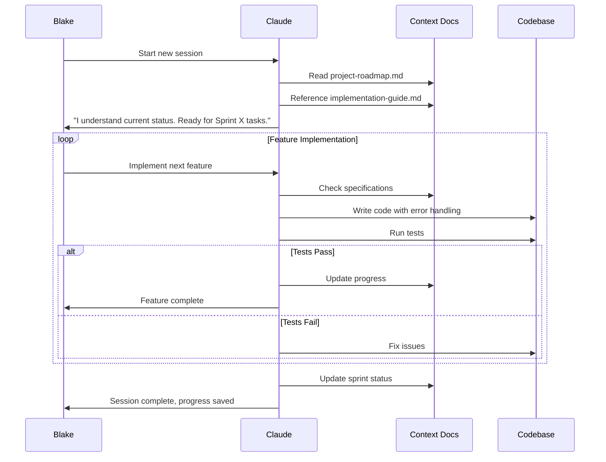
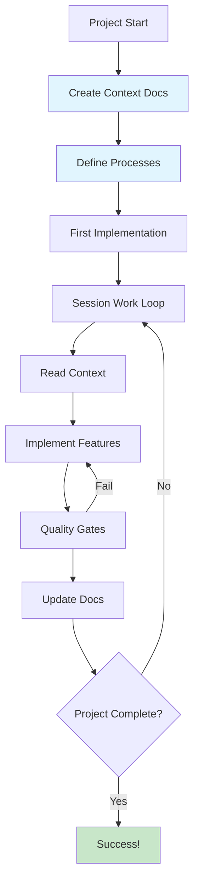

# Câu Chuyện Context Management: Từ Chaos Đến Mastery

> **Hai developer, hai cách tiếp cận AI coding, hai kết quả hoàn toàn khác biệt**

## Hai Câu Chuyện Cùng Một Project

Tháng trước, tôi viết về [8 Best Practices chuyển từ Vibe Coding sang Professional AI Development](https://phucnt.substack.com/p/ai-coding-tu-vibe-coding-en-chuyen). Hôm nay tôi muốn kể về discovery quan trọng nhất qua một case study thực tế:

**Context Management chính là cái quyết định bạn thành công hay thất bại với AI coding.**

## Câu Chuyện Số 1: Alex - The "Wing It" Developer

### Approach: Vibe Coding Style

Alex nhận task build MCP server cho Confluence Data Center. Dự án cần 11 tools để AI assistants có thể manage pages, search content, handle comments. Nghe đơn giản, Alex nghĩ.

**Session đầu tiên với Claude:**
```
Alex: "Tôi cần build MCP server cho Confluence DC, có 11 tools"
Claude: "OK, bạn cần tools nào cụ thể?"
Alex: "Ồ... createPage, getPage... ờm còn gì nữa nhỉ..."
```

**Kết quả:**
- 30 phút chỉ để explain requirements vague
- Claude implement createPage, nhưng authentication logic sai
- Alex fix xong, session mới Claude lại hỏi từ đầu
- Mỗi tool implementation inconsistent với nhau

**3 tuần sau:**
- Chỉ hoàn thành 4/11 tools
- Code quality thấp, architecture messy
- Mỗi session mất 20-30 phút setup lại context
- Stress level: 📈📈📈

## Câu Chuyện Số 2: Blake - The "Context Master"

### Approach: Documentation-First

Blake cũng nhận cùng task. Nhưng thay vì rush vào coding, Blake spent 2 hours đầu tiên viết documentation.

**Documentation Structure:**
```
docs/
├── 00_context/              # AI's Long-term Memory
│   ├── requirements.md      # Business goals, success criteria
│   ├── implementation-guide.md  # Technical architecture, patterns
│   └── api-reference.md     # Complete tool specifications
├── 01_plan/                 # Project Management  
│   └── project-roadmap.md   # Timeline, current status, sprints
└── 02_implement/           # Sprint Execution
    ├── sprint-1.md         # Detailed task breakdown
    ├── sprint-2.md         # Daily progress tracking
    └── sprint-3.md         # Acceptance criteria
```

**Session đầu tiên với Claude:**
```
Blake: "Chúng ta bắt đầu project MCP server. Hãy đọc docs/00_context/ trước"
Claude: "Tôi đã hiểu requirements. Theo roadmap, chúng ta start với Sprint 1 - 5 page management tools. Based on implementation-guide, tôi sẽ sử dụng single API client pattern với comprehensive error handling..."
```

**Magic happened.**

## The Context Management Framework

### Step 1: Build Agent's "Memory"

Tôi tạo `docs/00_context/` như "long-term memory" cho Claude:

**requirements.md**: "Claude, đây là những gì chúng ta đang build"
- Business goals: Enterprise Confluence integration for AI
- Success metrics: 11 tools, works with Claude/Cline/Cursor
- Technical constraints: Data Center deployment, Personal Access Token auth

**implementation-guide.md**: "Claude, đây là cách chúng ta code"
- Architecture: Single client, REST API v1
- Error handling patterns: Comprehensive status codes
- Code style: TypeScript strict mode, consistent naming

**api-reference.md**: "Claude, đây là complete specs"
- All 11 tools with exact parameters
- Request/response formats
- Authentication flows

### Step 2: Define Agent's "Workflow"

Blake tạo `CLAUDE.md` như "professional handbook":

**Workflow Mỗi Session:**
```
1. Đọc project-roadmap.md → Hiểu current status
2. Reference context docs → Understand requirements  
3. Focus trên current sprint tasks
4. Implement với quality gates
5. Update progress documents
```

**Task Management Process:**
```
Implementation Loop:
1. Code với proper error handling
2. Build & test → Must pass
3. Update documentation
4. Commit với clear message
5. Update sprint progress
```



### Step 3: The Results

**Session tiếp theo với Claude:**
```
Blake: "Chúng ta tiếp tục project"
Claude: "Tôi thấy chúng ta đang ở Sprint 1.2, cần implement createPage và getPageContent. Based trên implementation-guide.md, tôi sẽ sử dụng single API client pattern với comprehensive error handling..."
```

**WOW.** Claude đã hiểu context ngay từ đầu session.

## So Sánh Kết Quả: Alex vs Blake

### Alex (Vibe Coding) - Sau 3 tuần:
- ❌ 4/11 tools hoàn thành
- ❌ Inconsistent architecture 
- ❌ 30 phút setup mỗi session
- ❌ High stress, low confidence
- ❌ Technical debt tích lũy

### Blake (Context Master) - Sau 3 tuần:
- ✅ 11/11 tools hoàn thành
- ✅ Production-ready code quality
- ✅ 2 phút setup mỗi session  
- ✅ Smooth workflow, high confidence
- ✅ Ready để publish npm package

## Process In Action: Real Examples

### Example 1: Mid-Project Change

```
Blake: "Tôi muốn thay deletePage bằng searchPages cho sprint này"

Claude: "Tôi hiểu. Theo project-roadmap.md, chúng ta đang ở Sprint 1.3. Thay deletePage bằng searchPages make sense vì:
- searchPages provide more value for AI workflows  
- deletePage có thể move sang Sprint 2 với getPageVersions
- Tôi sẽ update roadmap và sprint docs accordingly"
```

**No re-explanation needed.** Claude understand project context và suggest reasonable approach.

### Example 2: Quality Issue Discovery

```
Blake: "Test với Cline, getPageContent return empty objects"

Claude: "Tôi thấy issue ở safe property access patterns. Dựa trên implementation-guide.md error handling standards, tôi cần fix response mapping trong get-page-content.ts:

Before: space: response.space  
After: space: response.space ? {...} : null

Fixing ngay..."
```

**Self-directed debugging.** Claude reference architecture patterns để solve problems independently.

### Example 3: Cross-Session Continuity

**Session 1**: Implement Sprint 1 tools  
**Session 2**: Add Sprint 2 features
**Session 3**: Complete Sprint 3 + documentation
**Session 4**: npm publishing

Mỗi session, Claude automatically:
- Read project-roadmap.md để hiểu current status
- Continue từ exact stopping point
- Maintain code quality consistency
- Update progress documents

## The Context Management Workflow

**Overall Process:**
```
Phase 1: Context Foundation (1-2 hours)
- Business requirements & success criteria  
- Technical architecture & patterns
- Complete specifications

Phase 2: Process Definition (30-60 minutes)
- Task management workflow
- Quality gates & standards  
- Documentation maintenance rules

Phase 3: Execution Excellence (ongoing)
- Start every session reading context
- Follow defined processes religiously
- Update documents continuously
```



## The Numbers Don't Lie

### Before Context Management:
- **Setup time mỗi session**: 15-30 minutes
- **Re-work rate**: 40-50% (inconsistent implementations)
- **Context loss**: Mỗi 2-3 sessions
- **Code quality**: Inconsistent, technical debt

### After Context Management:
- **Setup time**: 0-2 minutes (Claude tự đọc context)
- **Re-work rate**: 5-10% (consistent implementations)
- **Context loss**: Zero across 4+ sessions
- **Code quality**: Production-ready, comprehensive

### ROI Calculation:
- **Time investment**: 2-3 hours setup docs
- **Time saved**: 10-15 hours không re-explain
- **ROI**: 400-500% for medium projects

## Project Outcome: The Proof

**Confluence Data Center MCP Server results:**
- ✅ **11/11 tools**: 100% functional success rate
- ✅ **Published**: `confluence-dc-mcp-server@1.0.0` trên npm  
- ✅ **Production ready**: Comprehensive error handling
- ✅ **Documentation**: Complete user guides
- ✅ **Cross-platform**: Works với Claude, Cline, Cursor

**From chaos to mastery in 3 months.**

## The Context Management Mindset

### What I Learned:

**1. AI = Teammate, Not Tool**  
Treat Claude như senior developer. Provide context, set expectations, define processes.

**2. Documentation = AI's Memory**
```
Context Docs = AI's long-term memory
Process Docs = AI's professional workflow
Progress Docs = AI's project understanding
```

**3. Investment Always Pays Off**
- Small projects: 2x efficiency improvement
- Medium projects: 4x efficiency improvement  
- Large projects: 10x efficiency improvement

### The Blake Framework:

**Phase 1: Context Foundation (1-2 hours)**
- Business requirements & success criteria
- Technical architecture & patterns
- Complete specifications

**Phase 2: Process Definition (30-60 minutes)**  
- Task management workflow
- Quality gates & standards
- Documentation maintenance rules

**Phase 3: Execution Excellence (ongoing)**
- Start every session reading context
- Follow defined processes religiously
- Update documents continuously

## Conclusion: Your Context Management Journey

**Context Management isn't just a skill - it's a mindset shift.**

Khi bạn stop treating AI như search engine và start treating như professional teammate, everything changes:

- ❌ **Alex's Approach**: "Hey AI, làm cái này giúp tôi"
- ✅ **Blake's Approach**: "Based on our architecture docs và current sprint requirements, implement this feature theo standards đã defined"

**The difference?** Blake's approach creates sustainable, scalable, high-quality software. Alex's approach creates technical debt và frustration.

**My challenge to you:**  
Be Blake, not Alex. Next project, đầu tư 2-3 hours setup context documents. Then watch your AI teammate transform from confused assistant thành senior developer.

**Context Management = AI Coding Mastery.**

---

*🚀 Confluence Data Center MCP Server source code tại: https://github.com/phuc-nt/confluence-dc-mcp-server*

*📦 Try it: `npm install -g confluence-dc-mcp-server`*